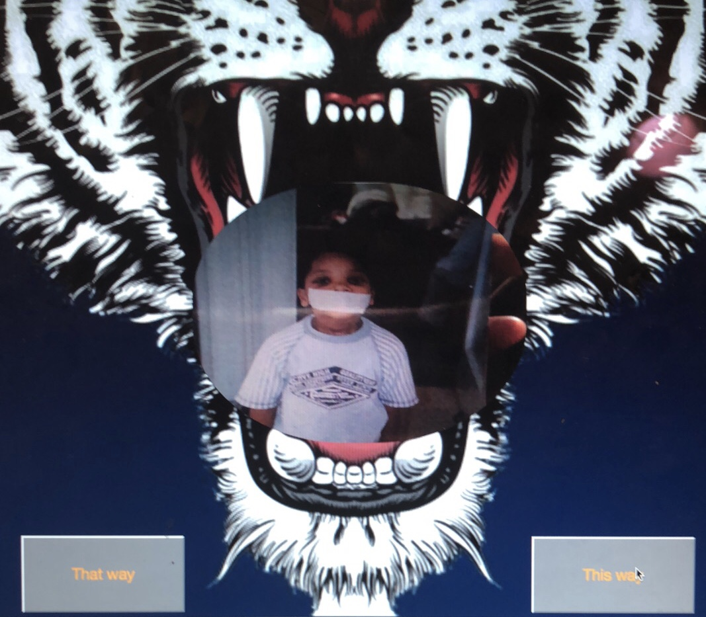

# carousel
A photo carousel of some old memories of me.

## How It's Made:

**Tech used:** HTML, CSS, JQuery

Taking a walk down memory lane I decided to take some photos and put them into a carousel. I'm from detroit so I thought it would be fun to put my background image as a tiger and make the photos round enough so that the photos could fit in the tigers mouth.

## Lessons Learned:
Learned how to make photos round and practiced on my media responsiveness. I also learned on to make the photos change in  a  continuous loop using buttons as the direction of moving through an Array.
